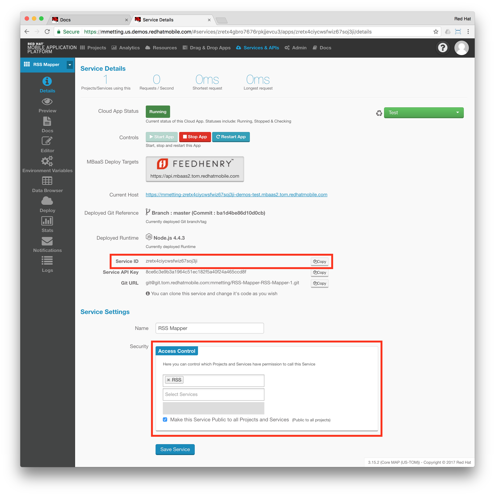

# RSS Cloud App

This Node.js application is the server side API for the [RSS Reader Demo](https://github.com/mmetting/RHMAP-RSS-Reader-Demo) client apps. It offers a REST-enpoint to retrieve RSS feeds in the following format:

```
{
    "title": "Hello World",
    "image": "https://opensource.com/sites/default/files/images/life/weekly_news_roundup_tv.png",
    "teaser": "Candy oat cake halvah ice cream icing bear claw brownie pie ice cream. Powder topping sugar plum lollipop brownie lollipop oat cake cookie."
}
```

The Cloud Application calls out to an [MBaaS Service](https://github.com/mmetting/RSS-Reader-Demo-Mapper-Service), which serves as the connector to the public RSS feeds.

The idea of the Cloud Application is, to be the public interface for mobile clients. Therefore server-side business logic could be implemented in it, to orchestrate or aggregate other service calls.
Additionally, the Cloud Application has access to all server-side APIs exposed by the RHMAP SDK, like Push Notifications, Data Storage, Caching, Forms or Synchronisation Support.

## Prerequisites
The following two MBaaS Service projects would need to be deployed to your RHMAP domain:
- [Connector Service](https://github.com/mmetting/RSS-Reader-Demo-RSS-Connector)
- [Mapping Service](https://github.com/mmetting/RSS-Reader-Demo-Mapper-Service)

> Please import, configure and deploy them first, before you go ahead and create the Cloud Application, as the Cloud App would use the above mentioned [Mapping Service](https://github.com/mmetting/RSS-Reader-Demo-Mapper-Service).

## Import as an exisiting Cloud Application into your project

- Open your project in RHMAP's AppStudio
- Click the little plus sign in the Cloud Code Apps' section
- Select `Import Existing App`
- Click `Next`

- Give the app a name: `RSS Cloud App`
- Click `Next`
- Select `Public Git Repository`
- Insert the following Git Repo URL: `https://github.com/mmetting/RHMAP-RSS-Reader-Demo-Cloud-App.git`
- Make sure, `master` is specified


- Click the button for `Import & Move on to Integration`


- Click `Finished - Take me My App`

## Considerations
Since the Cloud App requests RSS feeds from an MBaaS Service, you would need to change the following Service-UUID to match your deployed [Mapping Service](https://github.com/mmetting/RSS-Reader-Demo-Mapper-Service):

Open the file `lib/feeds.js` and change the `fh.service()`call:

```
...
fh.service({
    "guid": "uo5dkux7uuypsdh5jlqv2aen", // <- this service uuid would need to match your deployed MBaaS Service
    "path": "/feeds",
    "method": "GET",
    "headers": {
        "Content-Type" : "application/json" 
    }
}
...
```
To find the Mapping Service's UUID, open the correspondig MBaaS Service and copy the Service ID from the details screen.

Also make sure, your Cloud App is able to talk to the Mapping Service by either making the Mapping Service public or adding your project the access control list:



Deploy your Cloud App, after you're done.

# Group RSS Feeds
This part of the README.md makes the Cloud App testable from RHMAP's App Studio. Please ignore, since the formatting is optimized for RHMAP.

# feeds [/feeds]

'RSS feeds' endpoint.

## feeds [GET] 

'RSS feeds' endpoint.

+ Response 200 (application/json)

    + Body
            [
                {
                    "title": "Hello World",
                    "image": "https://opensource.com/sites/default/files/images/life/weekly_news_roundup_tv.png",
                    "teaser": "Candy oat cake halvah ice cream icing bear claw brownie pie ice cream. Powder topping sugar plum lollipop brownie lollipop oat cake cookie. Lollipop dragée chocolate halvah biscuit. Dragée liquorice sweet. Candy canes dragée marshmallow muffin macaroon cheesecake apple pie bear claw bear claw."
                },
                {
                    "title": "Hello World",
                    "image": "https://opensource.com/sites/default/files/images/life/weekly_news_roundup_tv.png",
                    "teaser": "Candy oat cake halvah ice cream icing bear claw brownie pie ice cream. Powder topping sugar plum lollipop brownie lollipop oat cake cookie. Lollipop dragée chocolate halvah biscuit. Dragée liquorice sweet. Candy canes dragée marshmallow muffin macaroon cheesecake apple pie bear claw bear claw."
                }
            ]
